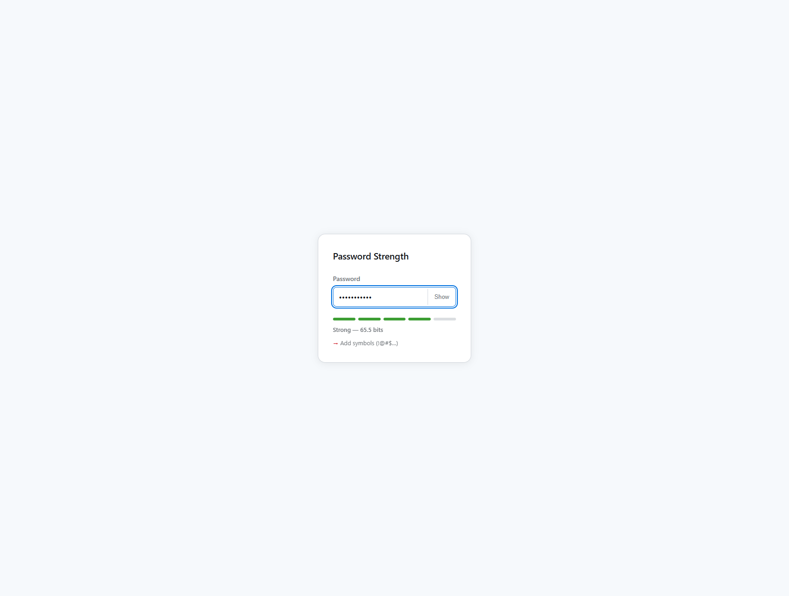

# Password Strength Analyzer

Real-time password strength scoring based on Shannon entropy — see exactly how secure your password is as you type.

[](https://github.com/Rblea97/password-strength-analyzer/actions)
[](https://Rblea97.github.io/password-strength-analyzer/)
[](https://opensource.org/licenses/MIT)



## Features

- Type a password and watch the strength score update instantly
- A 5-level meter (Very Weak → Very Strong) shows where you stand at a glance
- Get specific tips on which character classes to add to improve your score
- Toggle password visibility while you type
- Fully keyboard-navigable and screen-reader compatible

## Tech Stack


**React 19** — `useId()` for accessible label binding; compiler-ready, no manual memoization needed.  
**TypeScript** — strict + `noUncheckedIndexedAccess` + `exactOptionalPropertyTypes` catches class-level bugs at compile time.  
**Vite** — sub-second HMR, native ESM, zero config overhead.  
**Vitest** — shares Vite's transform pipeline; no separate test runner setup.  
**Native CSS** — `@layer`, `oklch()` color tokens, native nesting — no preprocessor or CSS-in-JS.

## Quick Start

```bash
pnpm install
pnpm dev
```

Open `http://localhost:5173/password-strength-analyzer/`

## Challenges + Solutions

**Overflow-safe entropy:** `Math.log2(charsetSize ** length)` overflows to `Infinity` for long passwords. Fixed by rewriting as `length * Math.log2(charsetSize)` — mathematically equivalent and numerically stable for any input length.

**CSS color progression without JS:** Strength level colors (red → green) are driven entirely by a `--strength-score` CSS custom property set inline on the meter element. Attribute selectors (`[style*='--strength-score: N']`) bind each score to its `oklch()` color token — zero JS needed for color transitions, no runtime style injection.

## Architecture

Pure logic/UI separation: `src/lib/strength.ts` is a dependency-free TypeScript module with zero React coupling — the entire scoring and feedback algorithm lives there and is unit-tested in isolation. React is a thin display layer. See [ARCHITECTURE.md](./ARCHITECTURE.md).

## License

MIT
